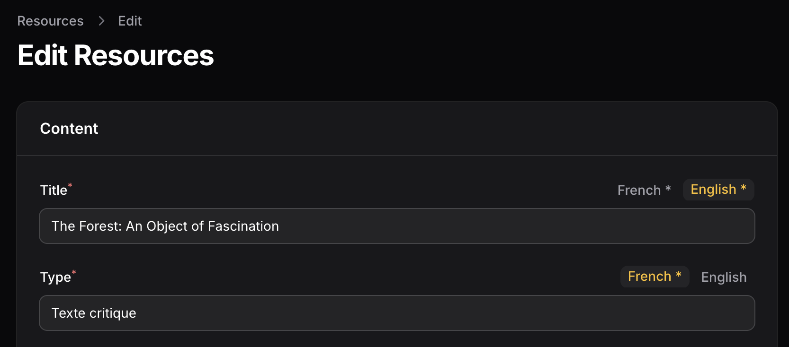

# Filament MultiLang Input

A component for managing multilingual fields in Filament 3, integrated with Spatie Laravel Translatable.



## Why This Plugin?

This plugin was created to offer a focused, input-level approach to multilingual content in Filament forms, unlike other solutions that implement translations at the page or fieldset level.

Key features:
- **Input-level language tabs**: Each translatable field has its own compact set of language tabs directly on the input
- **Flexible validation**: Define which languages are required on a per-field basis
- **Multiple input types**: Works seamlessly with both standard text inputs and rich text editors

The goal is to provide a streamlined editing experience for multilingual content that feels natural and integrated with Filament's design philosophy.

## Installation

You can install the package via composer:

```bash
composer require jeromesiau/filament-multilang
```

This package automatically integrates [Spatie Laravel Translatable](https://github.com/spatie/laravel-translatable) to efficiently manage translations storage.

To configure available languages, you can publish the configuration file:

```bash
php artisan vendor:publish --tag="filament-multilang-config"
```

The published configuration file will look like this:

```php
return [
    'locales' => [
        'fr' => ['name' => 'French'],
        'en' => ['name' => 'English'],
    ],
];
```

Simply modify the `locales` array to add, remove, or change the available languages for your application. Each language requires a key (language code) and a name that will be displayed in the language tabs.

By default, when displaying values in Filament tables, the component will use the translation that corresponds to your application's current locale (`APP_LOCALE` environment variable by defaut). This ensures a consistent display in listings while still maintaining full multilingual capabilities in forms.

## Model Configuration

To use the component with your models, make sure they use Spatie's `HasTranslations` trait:

```php
use Spatie\Translatable\HasTranslations;
use Illuminate\Database\Eloquent\Model;

class Page extends Model
{
    use HasTranslations;
    
    public $translatable = ['title', 'content'];
}
```

Important: Spatie Translatable recommends that translatable database fields should be defined as `json` type (or `text` if JSON is not available in your database). Make sure your migration reflects this:

```php
Schema::create('pages', function (Blueprint $table) {
    $table->id();
    $table->json('title');
    $table->json('content');
    $table->timestamps();
});
```

## Usage

```php
use JeromeSiau\FilamentMultilang\Components\MultiLangInput;

// In your Filament form
MultiLangInput::make('title')
    ->required() // All languages will be required

// For rich text fields
MultiLangInput::make('content')
    ->type('rich')
    ->required()

// To make only specific languages required
MultiLangInput::make('title')
    ->required()
    ->requiredLocales(['fr'])

// Customize available languages
MultiLangInput::make('title')
    ->locales([
        'fr' => ['name' => 'French'],
        'en' => ['name' => 'English'],
        'es' => ['name' => 'Spanish'],
    ])

// Customize rich editor toolbar buttons
MultiLangInput::make('content')
    ->type('rich')
    ->toolbarButtons([
        'bold',
        'italic',
        'link',
    ])

// Set editor height
MultiLangInput::make('content')
    ->type('rich')
    ->editorHeight('300px')
```

## Data Transformation

You can transform data before it's stored:

```php
MultiLangInput::make('content')
    ->type('rich')
    ->transform(
        function ($value) {
            // Transform value before storing
            return clean($value);
        },
        function ($value) {
            // Transform value when retrieved
            return $value;
        }
    )
```

## Data Structure

Data is stored as an associative array with language codes as keys:

```php
[
    'fr' => 'French content',
    'en' => 'English content',
]
```

With Spatie Laravel Translatable, this array is automatically stored in a JSON field in your database, which greatly simplifies translation management.

## Styling

The component comes with default styling that places language tabs neatly at the top-right of each input field. You can customize the appearance by targeting the `.fi-multilang-input` CSS class in your own stylesheets.

## Credits

- [Jérôme Siau](https://github.com/jeromesiau)
- [All Contributors](../../contributors)

## License

MIT 
